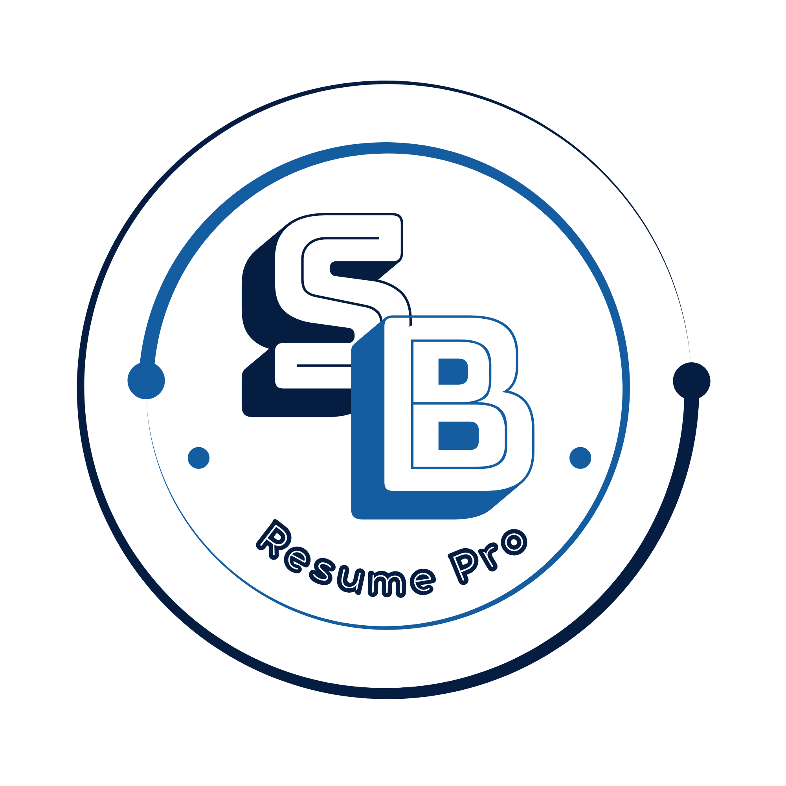

# 📄 ResumePro — AI-Powered Resume Builder

<p align="center">
  
</p>

<p align="center">
  <strong>Create, customize, preview and download professional resumes with an integrated Gemini AI Assistant.</strong>
</p>

<p align="center">
  <a href="https://resume-builder-at2p.onrender.com/">🌐 Live Demo</a> ·
  <a href="https://github.com/sandeepbharat211/resume-builder">💻 GitHub Repository</a>
</p>

<p align="center">
  
  
  
  
  
  
  
</p>

---

## 🌐 Live Demo

**Live Application:**  
https://resume-builder-at2p.onrender.com/

**GitHub Repository:**  
https://github.com/sandeepbharat211/resume-builder/

> The live application is deployed on Render. Free hosting may take a short time to wake up after inactivity.

---

# 📌 About the Project

**ResumePro** is a full-stack Django web application for creating professional resumes online.

The application gives users a complete resume-building workflow: users can create an account, build and manage resumes, add detailed career information, select a resume design, use AI to generate or improve content, preview the result, and generate a PDF.

The project also contains a custom staff/admin dashboard with user, resume, template and visitor analytics.

---

# ✨ Key Features

## 👤 User Authentication & Profile

- User registration and login
- Logout and password change
- User profile management
- Profile photo upload
- Photo crop/zoom functionality
- Contact information
- Bio/about information
- LinkedIn, GitHub and website links
- User-specific resume management

## 📝 Complete Resume Builder

A resume can contain:

- Personal information
- Professional summary
- Education
- Work experience
- Projects
- Skills
- Certificates
- Languages
- Hobbies
- Profile/resume photo
- Social and portfolio links

## 🎨 Multiple Resume Templates

ResumePro provides four resume designs:

- Modern
- Professional
- Creative
- Executive

Users can choose a template and change the design later without rebuilding the resume.

## 🤖 Gemini AI Assistant

The integrated AI Assistant helps users create resume content.

It supports tasks such as:

- Career summary generation
- Skill suggestions
- Job description generation
- Project description generation
- Full resume content assistance

The AI workflow keeps the user in control:

```text
User Input
    ↓
Gemini AI
    ↓
Generated Content
    ↓
User Reviews / Edits
    ↓
User Saves
    ↓
Resume Updated
```

## 📄 Resume Preview & PDF

Users can preview their resume before downloading it.

The application uses **WeasyPrint** to convert the resume HTML/CSS template into a PDF.

```text
Resume Data
    ↓
Selected Template
    ↓
HTML + CSS
    ↓
Resume Preview
    ↓
WeasyPrint
    ↓
PDF
```

## 🛡️ Custom Admin Dashboard

The project includes a custom staff-only admin dashboard with information such as:

- Total users
- Active users
- New users
- Total resumes
- Recent resumes
- Visitor statistics
- Template usage
- User management
- Resume management

The project also keeps the standard Django Admin available separately.

## 📊 Visitor Tracking

A custom middleware records website analytics for normal page requests, including:

- Visitor IP
- Requested page
- User/session information
- User agent
- Visit timestamp

Static/media requests and selected administrative/polling endpoints are excluded.

---

# 📸 Screenshots

The screenshots below are from the actual ResumePro application.

## 🏠 Home Page

The landing page introduces ResumePro, displays the available professional templates and provides access to the main resume-building workflow.


---

## 📝 Sign Up

New users can create a ResumePro account through the registration page.


---

## 🔐 Login

Existing users can securely sign in and access their resumes and dashboard.


---

## 📊 User Dashboard

The dashboard gives users an overview of their resumes and resume-related information, with quick actions for creating and managing resumes.


---

## 🧾 Create Resume

The resume creation interface collects the information required to build a complete professional resume.


---

## 📋 Resume View / Management

Users can view and manage their saved resume information from the application.


---

## 🎨 Resume Preview

The selected resume template renders the user's information into a professional resume layout.


---

## 🤖 AI Assistant

The Gemini-powered AI Assistant helps generate professional resume content such as summaries, skills, job descriptions and project descriptions.


---

## 👤 User Profile

Users can manage account information, profile details and their saved resumes from the profile area.


---

## ℹ️ About ResumePro

The About page explains the purpose and major capabilities of the ResumePro application.


---

## 🛡️ Custom Admin Dashboard

Staff users can monitor application activity through a dedicated analytics dashboard.


---

## 👥 User Management

Staff users can inspect registered users and their related resume information.


---

## 📄 All Resumes

The custom admin area provides an overview of resumes created in the application.


---

## ⚙️ Django Admin

The standard Django administration interface is also available for model-level management.


---

# 🛠️ Technology Stack

### Backend

- Python
- Django
- Django ORM
- Django Authentication
- Django Middleware

### Frontend

- HTML5
- CSS3
- JavaScript
- Bootstrap 5
- Bootstrap Icons
- Google Fonts

### Database

- MySQL
- SQLite option for local development/testing

### AI

- Google Gemini API
- Gemini 2.5 Flash

### PDF Generation

- WeasyPrint

### Image Processing

- Pillow
- Client-side photo crop/zoom functionality

### Configuration

- python-dotenv
- Environment variables

### Production

- Gunicorn
- Render

### Version Control

- Git
- GitHub

---

# 🏗️ Project Architecture

```text
                         ┌────────────────────┐
                         │      Browser       │
                         └─────────┬──────────┘
                                   │
                                   ▼
                         ┌────────────────────┐
                         │    Django URLs     │
                         └─────────┬──────────┘
                                   │
                                   ▼
                         ┌────────────────────┐
                         │       Views        │
                         └──────┬───┬───┬─────┘
                                │   │   │
                 ┌──────────────┘   │   └──────────────┐
                 ▼                  ▼                  ▼
            ┌─────────┐       ┌─────────┐       ┌────────────┐
            │  Forms  │       │ Models  │       │ Gemini API │
            └─────────┘       └────┬────┘       └────────────┘
                                    │
                                    ▼
                              ┌──────────┐
                              │ Database │
                              └──────────┘

Resume Template
      │
      ▼
 HTML + CSS
      │
      ├──────────────► Browser Preview
      │
      └──────────────► WeasyPrint
                              │
                              ▼
                         PDF Download
```

---

# 📂 Project Structure

```text
resume_builder/
│
├── manage.py
├── requirements.txt
├── SETUP.txt
├── .gitignore
├── .env
│
├── accounts/
│   ├── admin.py
│   ├── forms.py
│   ├── models.py
│   ├── urls.py
│   ├── views.py
│   └── migrations/
│
├── resume/
│   ├── admin.py
│   ├── forms.py
│   ├── middleware.py
│   ├── models.py
│   ├── urls.py
│   ├── views.py
│   ├── templatetags/
│   └── migrations/
│
├── resume_builder/
│   ├── settings.py
│   ├── urls.py
│   ├── asgi.py
│   └── wsgi.py
│
├── templates/
│   ├── base.html
│   ├── home.html
│   ├── dashboard.html
│   ├── create_resume.html
│   ├── edit_resume.html
│   ├── resume_detail.html
│   ├── resume_list.html
│   ├── choose_template.html
│   ├── change_template.html
│   │
│   ├── accounts/
│   ├── custom_admin/
│   │
│   └── resume/
│       └── templates/
│           ├── modern.html
│           ├── professional.html
│           ├── creative.html
│           └── executive.html
│
├── static/
│   ├── css/
│   │   └── style.css
│   ├── js/
│   │   ├── script.js
│   │   └── photo-cropper.js
│   └── images/
│
└── media/
    ├── profile_photos/
    └── resume_photos/
```

---

# 🗄️ Database Design

The application uses Django models and relationships to organize resume information.

The main structure is:

```text
User
 │
 ├── UserProfile
 │
 └── Resume
       │
       ├── Education
       ├── Experience
       ├── Project
       ├── Skill
       ├── Certificate
       ├── Language
       └── Hobby
```

A user can manage multiple resumes, and each resume can contain multiple records for its different sections.

The project also includes a `SiteVisitor` model for visitor analytics.

---

# 🔐 Environment Variables

Sensitive values should be stored in environment variables and **never committed to GitHub**.

Create a `.env` file in the same directory as `manage.py`.

Example:

```env
DJANGO_SECRET_KEY=your-secret-key
DJANGO_DEBUG=True
DJANGO_ALLOWED_HOSTS=127.0.0.1,localhost

DB_NAME=resume_builder_db
DB_USER=your_mysql_user
DB_PASSWORD=your_mysql_password
DB_HOST=localhost
DB_PORT=3306

GEMINI_API_KEY=your_gemini_api_key

USE_SQLITE=False
```

> ⚠️ Do not copy real API keys, database passwords or secret keys into this README.

---

# 💻 Local Installation

## 1. Clone the Repository

```bash
git clone https://github.com/sandeepbharat211/resume-builder.git
cd resume-builder
```

## 2. Create a Virtual Environment

### Windows

```bash
python -m venv venv
venv\Scripts\activate
```

### Linux / macOS

```bash
python3 -m venv venv
source venv/bin/activate
```

## 3. Install Dependencies

```bash
pip install -r requirements.txt
```

## 4. Configure Environment Variables

Create `.env` and add the required configuration.

## 5. Run Migrations

```bash
python manage.py makemigrations
python manage.py migrate
```

## 6. Create a Superuser

```bash
python manage.py createsuperuser
```

## 7. Collect Static Files

```bash
python manage.py collectstatic
```

## 8. Start the Development Server

```bash
python manage.py runserver
```

Open:

```text
http://127.0.0.1:8000/
```

---

# 🗄️ MySQL Setup

Create a MySQL database:

```sql
CREATE DATABASE resume_builder_db
CHARACTER SET utf8mb4
COLLATE utf8mb4_unicode_ci;
```

Then configure:

```env
DB_NAME=resume_builder_db
DB_USER=your_mysql_user
DB_PASSWORD=your_mysql_password
DB_HOST=localhost
DB_PORT=3306
```

### SQLite Alternative

For quick local testing, use:

```env
USE_SQLITE=True
```

This allows the project to use a local `db.sqlite3` database instead of MySQL.

---

# 🤖 Gemini AI Setup

ResumePro uses Google's Gemini API for AI-assisted resume content.

Create an API key through Google AI Studio:

https://aistudio.google.com/app/apikey

Then add:

```env
GEMINI_API_KEY=your_gemini_api_key
```

The AI Assistant is designed to generate content that the user can review and edit before saving.

---

# 📄 PDF Generation

ResumePro uses **WeasyPrint** for PDF generation.

If the Python package is installed but PDF generation reports missing native dependencies, follow the official WeasyPrint installation guide:

https://doc.courtbouillon.org/weasyprint/stable/first_steps.html

---

# ☁️ Render Deployment

The project can be deployed using Gunicorn on Render.

### Production Start Command

```bash
gunicorn resume_builder.wsgi:application
```

### Recommended Environment Variables

```text
DJANGO_SECRET_KEY
DJANGO_DEBUG=False
DJANGO_ALLOWED_HOSTS
DB_NAME
DB_USER
DB_PASSWORD
DB_HOST
DB_PORT
GEMINI_API_KEY
USE_SQLITE=False
```

After deployment, verify:

- Home page
- Signup/login
- Dashboard
- Resume creation
- Template selection
- AI Assistant
- PDF generation
- Profile/media uploads
- Admin access

---

# 🔗 Important URLs

| Purpose | URL |
|---|---|
| Home | `/` |
| Dashboard | `/dashboard/` |
| Create Resume | `/create/` |
| Resume List | `/list/` |
| Choose Template | `/choose-template/` |
| Profile | `/accounts/profile/` |
| Login | `/accounts/login/` |
| Signup | `/accounts/signup/` |
| Custom Admin | `/myadmin/` |
| Django Admin | `/django-admin/` |

---

# 🔒 Security

ResumePro uses several basic security practices:

- Environment variables for secrets
- `.env` excluded from Git
- Django authentication
- User-specific resume access
- Staff-only custom administration
- Database credentials outside source code
- Gemini API key outside source code

If a secret is ever accidentally committed to a public repository, rotate/revoke it immediately.

---

# 🔄 Complete User Workflow

```text
Register
   ↓
Login
   ↓
Dashboard
   ↓
Choose Resume Template
   ↓
Create Resume
   ↓
Add Personal Information
   ↓
Add Education / Experience / Projects
   ↓
Add Skills / Certificates / Languages / Hobbies
   ↓
Use Gemini AI Assistant (Optional)
   ↓
Review & Edit Content
   ↓
Resume Preview
   ↓
Print / Download PDF
```

---

# 🛡️ Admin Workflow

```text
Staff Login
    ↓
Custom Admin Dashboard
    ├── Analytics
    ├── User Management
    ├── Resume Management
    ├── Template Usage
    └── Visitor Statistics
              │
              ▼
       Django Admin
```

---

# 🐛 Troubleshooting

### CSS/JavaScript changes are not appearing

Try a hard refresh:

```text
Ctrl + Shift + R
```

Also verify static files are collected in production.

### Database connection error

Check:

```text
DB_NAME
DB_USER
DB_PASSWORD
DB_HOST
DB_PORT
```

Also make sure the database server is running.

For quick local testing:

```env
USE_SQLITE=True
```

### Gemini AI error

Verify:

```env
GEMINI_API_KEY=your_key
```

and confirm the key is valid and has access to the configured Gemini model.

### PDF generation error

Verify WeasyPrint installation and any required system libraries.

---

# 🚀 Future Improvements

Potential future improvements include:

- More resume templates
- ATS-focused resume analysis
- Job-description-based resume customization
- AI keyword optimization
- Resume version history
- Public/shareable resume links
- Additional export formats
- Drag-and-drop resume sections
- Email resume sharing
- More advanced analytics
- Cloud media storage
- Improved mobile experience
- Automated CI/CD deployment

---

# 🎯 What This Project Demonstrates

This project demonstrates practical experience with:

- Python development
- Django full-stack development
- Database design
- Django ORM
- Authentication
- CRUD operations
- File uploads
- Image processing
- Responsive UI development
- AI API integration
- Generative AI workflows
- PDF generation
- Custom middleware
- Visitor analytics
- Admin dashboard development
- Environment-based configuration
- Git/GitHub
- Cloud deployment with Render

---

# 👨‍💻 Author

**Sandeep Bharat**

- GitHub: https://github.com/sandeepbharat211/resume-builder/
- Live Project: https://resume-builder-at2p.onrender.com/

---

# ⭐ Support the Project

If you find ResumePro useful or interesting, consider giving the repository a ⭐ on GitHub.

---

## ❤️ ResumePro

**Build your resume. Improve your content. Choose your design. Download your professional resume.**

Built with **Python, Django, Bootstrap, MySQL, Gemini AI and WeasyPrint**.
